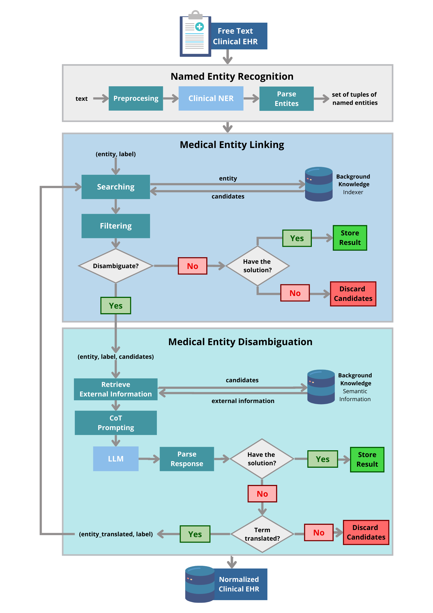

# NSSC: Neuro-Symbolic System for Cancer


NSCC is a system designed to address the challenge of **oncological entity linking** in clinical narratives written in Spanish. The repository contains a variety of components, each contributing to different aspects of the system's functionality.





## NSCC System Overview

NSSC employs a holistic approach to oncological entity linking, combining deep learning for context-aware Named Entity Recognition (NER), symbolic reasoning for capturing complex relationships and semantics within clinical text, and large language models (LLMs) for entity disambiguation.

- **Named Entity Recognition:** Utilizes state-of-the-art techniques to recognize and classify oncological entities such as tumor types, treatment modalities, and relevant clinical concepts.

- **Medical Entity Linking:** Integrates background knowledge and rule-based methods to identify the most appropriate terms in the Unified Medical Language System (UMLS).

- **Medical Entity Disambiguation:** Detects cases requiring disambiguation and, through prompt engineering over LLMs, identifies the most appropriate UMLS terms for recognized entities.

For detailed information on NSSC components, refer to the respective files in the repository.


## Repository Structure

- **bk_indexer.py:** Module for managing background knowledge used in symbolic reasoning.
- **bk_definitions.py:** Script for obtaining definitions.

- **eval:**
  - **eval_elastic.py:** Evaluation script for Search-based entity linking.
  - **evaluation.py:** General evaluation utilities.
  - **finetune_th.py:** Script for fine-tuning models.
  - **golds.py:** Module for handling gold standard data.
  - **metrics.py:** Metrics calculation utilities.
  - **rules_to_validate.md:** Documentation on rules for validation.
  

- **llm.py:** Module for handling large language models (LLMs).
    
- **ner.py:** Script for handling Named Entity Recognition (NER) using deep learning.
  
- **nssc.py:** Main module encapsulating the NSCC system.
  
- **optimization.py:** Module for optimization-related functionalities.
    
- **static:**
  - **golds.json:** Gold standard data in JSON format.
  - **sample.md:** Sample clinical narrative for testing purposes.
  - **sample_query_BK.json:** Sample query data related to background knowledge.
  
- **utils.py:** General utility functions for various tasks.


**Note:** Ensure that you review the LICENSE file for usage permissions and restrictions.


### Set up

Install dependencies:

   ```bash
   pip install -r requirements.txt
   ```

### Acknowledgments

- This research is based on the paper [NSCC: A Neuro-Symbolic AI System for Enhancing Accuracy of Named Entity Recognition and Linking from Oncological Clinical Notes](https://link.springer.com/article/10.1007/s11042-024-19209-5), published in [journal]().
- If you find it useful you can cite it in:
```bibtext

```
